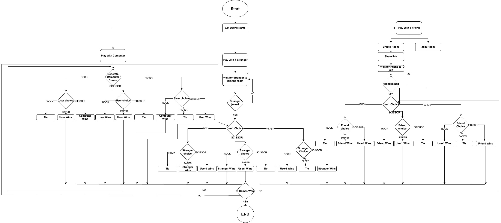
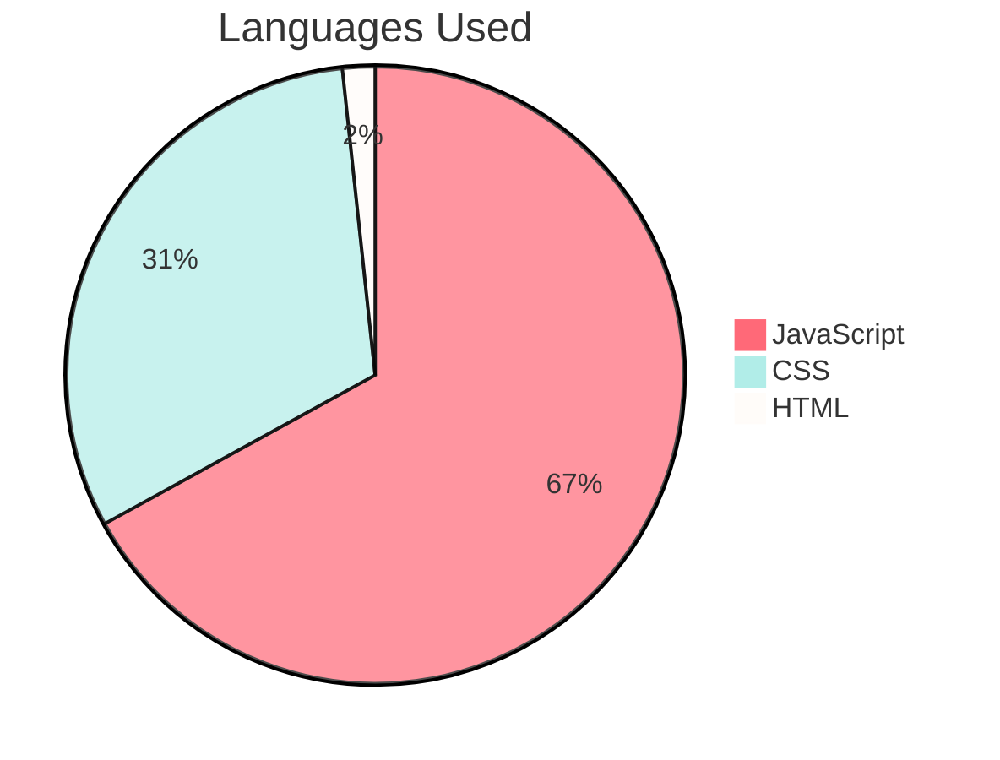

# Rock-Paper-Scissors Game (by CYF London9 Trainees)

<!-- ALL-CONTRIBUTORS-BADGE:START - Do not remove or modify this section -->

[](#contributors-)

<!-- ALL-CONTRIBUTORS-BADGE:END -->

This is a creative representation of the well-known Rock-Paper-Scissors Game implemented using React.js.

## Deployed Website

Access the deployed version of the application: <a href="https://rock-paper-scissors-team.netlify.app/">rock-paper-scissors-team.netlify.app</a>

## Game Rules

- The game enables 3 options:
  - Play with Computer
  - Play with a Stranger
  - Play with a Friend
    - Create a room
    - Join a room
- The User has 3 options to choose: Rock, Paper, Scissors
- The Main Rules:
  - A Rock beats Scissors
  - Scissors beat Paper by cutting it
  - Paper beats Rock by covering it
- There are 3 options at the end of a Round: User Wins, Computer Wins or Tie.
- The Game ends when a player wins 3 Rounds.

## Features

- [x] The game establishes 2 options based on number of participants:
  - [x] Uniplayer : Play with Computer
  - [x] Multiplayer : Play with a Friend/ Play with a Stranger.
- [x] The application requires the <b>user's name</b> to enhance user experience.
- [x] The application provides user with 3 options: <b>Rock, Paper, Scissors</b>
- [x] The application enables the option to <b>Change the User Name</b>.
- [x] The application provides the option to the restart the game at the end of it.
- [x] The game starts only after the user inserts its name.

## Flow Chart



## Technologies Used:

- [x] JavaScript Frameworks: React
- [x] Node.js
- [x] Socket.io
- [x] CSS, HTML
- [x] Font Scripts: Google Font API

## Pie Chart Of Languages Used



## Installation

**Clone the repository:**

```bash
git clone github.com/Bahare09/team-game-rock-paper-scissors.git
```

**Install dependencies:**

```bash
npm install
```

**Start the development server:**

```bash
npm start
```

## Contributors

<!-- ALL-CONTRIBUTORS-LIST:START - Do not remove or modify this section -->
<!-- prettier-ignore-start -->
<!-- markdownlint-disable -->
<table>
  <tbody>
    <tr>
     <td align="center" valign="top" width="14.28%"><a href="https://shayanmahnam.netlify.app"><br /><sub><b>Shayan Mahnam</b></sub></a><br /><a href="#projectManagement-ShayanMahnam" title="FrontEnd">💻</a></td>
       <td align="center" valign="top" width="14.28%"><a href="https://github.com/VitalinaKuzmenko"><br /><sub><b>Vitalina</b></sub></a><br /><a href="https://github.com/Bahare09/team-game-rock-paper-scissors/commits?author=VitalinaKuzmenko" title="Code">💻</a> </td>
      <td align="center" valign="top" width="14.28%"><a href="https://github.com/LorenaCapraru"><br /><sub><b>Lorena</b></sub></a><br /><a href="https://github.com/Bahare09/team-game-rock-paper-scissors/commits?author=LorenaCapraru" title="Code">💻</a></td>
       </tr>
    <tr>
      <td align="center" valign="top" width="14.28%"><a href="https://github.com/Bahare09"><br /><sub><b>Bahare</b></sub></a><br /><a href="https://github.com/Bahare09/team-game-rock-paper-scissors/commits?author=Bahare09" title="Code">📆</a></td>
        <td align="center" valign="top" width="14.28%"><a href="https://github.com/laxmikckarki"><br /><sub><b>Laxmi</b></sub></a><br /><a href="https://github.com/Bahare09/team-game-rock-paper-scissors/commits?author=laxmikckarki" title="Code">💻</a></td>
        <td align="center" valign="top" width="14.28%"><a href="https://github.com/Tony-devops"><br /><sub><b>Tony</b></sub></a><br /><a href="https://github.com/Bahare09/team-game-rock-paper-scissors/commits?author=Tony-devops" title="Code">💻</a> </td>
        </tr>
  </tbody>
</table>

<!-- markdownlint-restore -->
<!-- prettier-ignore-end -->

<!-- ALL-CONTRIBUTORS-LIST:END -->
<!-- markdownlint-disable -->

<!-- markdownlint-restore -->
<!-- prettier-ignore-end -->

<!-- ALL-CONTRIBUTORS-LIST:END -->
